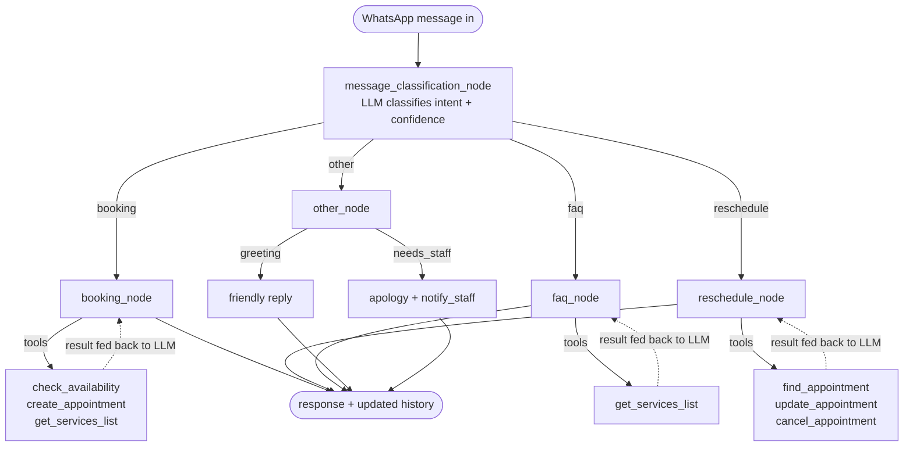

# Front Desk AI

An AI-powered WhatsApp receptionist for a salon/clinic. Handles bookings, rescheduling, cancellations, and FAQs through natural conversation, backed by a Django database and a LangGraph agent.

## What it does

A customer messages the salon on WhatsApp. The agent:
- Classifies intent (booking / faq / reschedule / other)
- Checks live staff availability and books appointments
- Reschedules or cancels existing appointments
- Answers questions about services, pricing, and hours
- Escalates to human staff when it's genuinely unsure, while handling greetings and small talk itself
- Remembers context across a conversation (multi-turn — e.g. "facial book karni hai" → "kal 9 baje" → "haan confirm")

## Tech stack

| Layer | Tool |
|---|---|
| Agent orchestration | LangGraph |
| LLM | Groq (`llama-3.3-70b-versatile`) via `langchain_groq` |
| Backend | Django + Django ORM |
| Database | SQLite (dev) |
| Messaging channel | Twilio WhatsApp Sandbox |
| Tunnel (local dev) | ngrok |

## Project structure

```
Front Desk AI/
├── manage.py
├── config/
│   ├── settings.py          # SALON_INFO, ALLOWED_HOSTS, Twilio/Meta credentials
│   └── urls.py               # routes /webhook/whatsapp/
├── salon/
│   ├── models.py             # Staff, Service, Client, Appointment, Conversation
│   └── admin.py
└── agent/
    ├── state.py               # State TypedDict (usr_msg, history, msg_category, ...)
    ├── prompts.py             # all system prompts (plain strings, not f-strings)
    ├── tools.py                # LangChain @tool functions + helpers
    ├── graph.py                # nodes, router, safety wrappers, compiled graph
    └── views.py                 # Twilio webhook (whatsapp_webhook)
```

## How the agent works

The agent is a single LangGraph `StateGraph` with one entry point, one routing decision, four possible branches, and a shared `State` dict that carries the conversation forward turn by turn.



### Node by node

**`message_classification_node`** — the entry point. Sends the current message plus the last 4 turns of history to the LLM with `with_structured_output()`, forcing a `{category, confidence}` response (`Literal["booking","faq","reschedule","other"]`). History is included specifically so that short follow-ups like *"haan confirm kar dein"* get classified as a continuation of the ongoing topic rather than falling through to `other`. If structured output fails outright, it falls back to a plain-text prompt and parses the category itself rather than crashing.

**`router`** — a pure Python function, no LLM call. Reads `state["msg_category"]` and returns the name of the next node. This is wired into the graph with `add_conditional_edges`.

**`booking_node`** — the most complex node. Given the conversation so far, it figures out what service/date/time the customer wants (asking one clarifying question at a time if something's missing), calls `check_availability`, and — only after the customer confirms — calls `create_appointment`. If the requested slot is taken, `create_appointment` doesn't just error out: it returns alternative slots (same staff first, then other staff) which the agent presents in the same reply.

**`reschedule_node`** — always calls `find_appointment` first to pull up the customer's upcoming bookings (since customers refer to "my appointment," never an ID). It then either updates the time (`update_appointment`) or cancels it (`cancel_appointment`), confirming with the customer before either action. Clash-checking on reschedule excludes the appointment's own current slot, so moving a booking to the same time it's already at doesn't falsely trigger a conflict.

**`faq_node`** — answers from static salon info baked into the system prompt (hours, address, policy), but for anything service- or price-related it's required to call `get_services_list` rather than recall numbers from memory — this is a deliberate anti-hallucination rule, added after testing showed the agent inventing plausible-but-wrong service names when a request didn't match anything in the database.

**`other_node`** — handles everything that didn't classify cleanly. It makes one more LLM call to distinguish a bare greeting ("Salam", "hi") from something that genuinely needs a human (a complaint, an out-of-scope request). Greetings get a warm reply and the conversation continues normally. Anything else gets a fixed, tested apology message, `escalate=True`, and a call to `notify_staff()` — a real complaint is not somewhere you want the LLM improvising.

### The tool-calling loop

Three of the four branches (`booking_node`, `reschedule_node`, `faq_node`) bind a set of `@tool`-decorated Python functions to the LLM via `bind_tools()`, then run a loop: invoke the model, execute whatever tools it asks for, feed the results back, repeat — until the model responds with plain text instead of another tool call, or a `max_iterations` cap is hit. This loop is shared logic (`run_tool_calling_loop` in `graph.py`) so the same reliability fixes apply everywhere:

- If the model emits a malformed `<function=name>{...}</function>` tag as plain text instead of a structured tool call (an occasional quirk of the Groq/Llama model in use), the loop detects the pattern with a regex, manually parses and executes it, and keeps going — the customer never sees the raw tag.
- If everything still fails, a final check strips any leaked `<function=` text before it reaches the reply.

### Safety net

Every node is wrapped in `safe_node_wrapper` before being added to the graph. If a node throws for any reason — a bad LLM response, a DB error, anything unanticipated — the wrapper catches it, sets `escalate=True`, and returns a graceful Urdu apology instead of letting the exception propagate. The webhook itself has a second layer of `try/except` around the whole `graph.invoke()` call, so even a total graph failure still results in *some* reply being sent rather than a silent timeout on the customer's end.

## Setup

```bash
python -m venv venv
source venv/bin/activate          # Windows: venv\Scripts\activate
pip install django djangorestframework langgraph langchain-groq python-dotenv twilio

python manage.py migrate
python manage.py createsuperuser
python manage.py runserver
```

Add test data via `/admin` — at least one `Staff`, a few `Service` entries, before testing bookings.

### Environment variables (`.env`)

```
GROQ_API_KEY=...
TWILIO_ACCOUNT_SID=...
TWILIO_AUTH_TOKEN=...
```

### `settings.py` essentials

```python
TIME_ZONE = 'Asia/Karachi'        # not UTC — affects "aaj/kal" date math
ALLOWED_HOSTS = ['.ngrok-free.dev', '.ngrok-free.app', 'localhost', '127.0.0.1']

SALON_NAME = "..."
SALON_WHATSAPP_NUMBER = "..."
SALON_INFO = {
    "name": SALON_NAME,
    "address": "...",
    "working_hours": "...",
    "phone": SALON_WHATSAPP_NUMBER,
    "policies": "...",
}
```

## Running with WhatsApp (Twilio Sandbox)

1. `python manage.py runserver`
2. In a second terminal: `ngrok http 8000`
3. Copy the `https://...ngrok-free.dev` forwarding URL
4. Twilio Console → Messaging → Try it out → Send a WhatsApp message → Sandbox Configuration → set **"When a message comes in"** to `https://<ngrok-url>/webhook/whatsapp/` (POST)
5. From your phone, WhatsApp `join <sandbox-code>` to the Twilio sandbox number once
6. Message the sandbox number to test

**Note:** Twilio trial accounts have a low daily message limit and the sandbox join session expires after ~72 hours of inactivity — rejoin if messages stop arriving.

## Known issues / things to watch

- **LLM tool-calling reliability**: `llama-3.3-70b-versatile` occasionally emits a malformed `<function=name>{...}</function>` tag as plain text instead of a structured tool call. `graph.py` detects and manually parses this pattern as a fallback (see `parse_malformed_tool_call`).
- **Tool argument types**: the LLM sometimes sends numeric IDs as strings (e.g. `appointment_id: "5"`). Tools cast with `int()` defensively.
- **Timezone-aware datetimes**: tools accept both naive and aware ISO datetime strings via `parse_start_time()` — the LLM isn't consistent about which it sends.
- **Service name matching**: customer phrasing ("haircut") won't always exact-match DB names ("Hair Cutting") — `find_service()` does normalized substring matching. If a service genuinely isn't found, the agent is instructed to call `get_services_list` rather than guess.
- **Classification needs history**: a bare confirmation like "haan confirm kar dein" is ambiguous without context — `message_classification_node` includes recent conversation history in the classification prompt to avoid misrouting these to `other_node`.

## Testing notes

The agent was tested via direct Python calls to individual nodes, then multi-turn conversations through the compiled graph, covering: full booking/reschedule/cancel flows, staff/slot clashes with alternative suggestions, intent-switching mid-conversation (FAQ→booking, greeting→booking), invalid services, unknown clients, gibberish input, and concurrent double-booking attempts.

## Roadmap

- [ ] Multi-appointment disambiguation (customer with 2+ upcoming bookings)
- [ ] Move off Twilio Sandbox to a production number (or Meta Cloud API) before real client use
- [ ] Owner-facing dashboard (Flutter or web) showing today's bookings, agent vs manual split
- [ ] Automated appointment reminders (Celery + Celery Beat)
- [ ] Move `SALON_INFO` fully into DB-backed settings so non-technical owner can edit hours/policies
